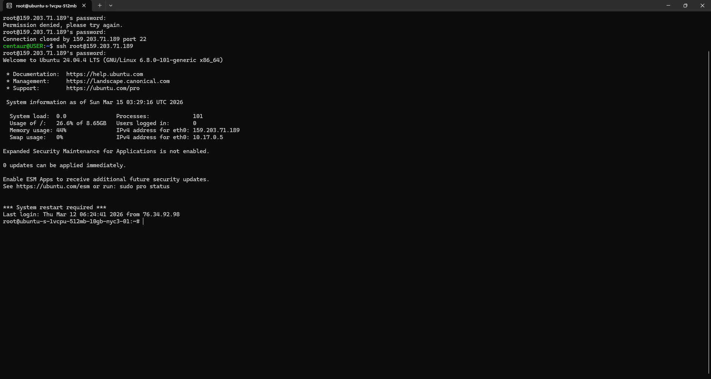
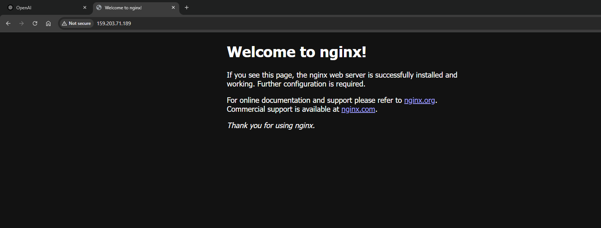

# Nginx Web Server Deployment on a Cloud VM

## Overview

This project demonstrates how to deploy a basic public web server on a cloud virtual machine.

The workflow included provisioning a Linux server in Digital Ocean, connecting to it via SSH, installing the nginx web server, and verifying that the server was accissible through its public IP address.

---

## Infrastructure Used

Cloud Provider: DigitalOcean Cloud
Server Type: Droplet  
Operating System: Ubuntu 24.04 LTS  
Web Server: nginx
Access Method: SSH via Linux command line

---

## Architecture Diagram

Browser
│
▼
Public Internet
│
▼
DigitalOcean Cloud VM (Ubuntu 24.04)
│
▼
nginx Web Server
│
▼
Default nginx Web Page

---

## Deployment Steps

1. Created a cloud server (Droplet) in DigitalOcean
2. Connected to the server using SSH
3. Updated the server packages
4. Installed nginx
5. Started the nginx service
6. Verified nginx status
7. Accessed the web server via the public IP address

---

## Verification

The nginx service was verified using the following command:

systemctl status nginx.

The output confirmed that the service status was: 

Active: active (running)

---

## Commands Used

Connect to the server

```bash
ssh root@159.203.71.189

```bash
Update package index

```bash
sudo apt update


```bash
Install nginx

```bash
sudo apt install nginx


```bash
Start nginx

```bash
systemctl start nginx

```bash

Check nginx status

```bash
systemctl status nginx

---

## Skills Demonstrated

- Cloud infrastructure provisioning
- SSH remote server access
- Linux package management using apt
- Managing services with systemd
- Deploying a web server using nginx
- Verifying network accessibility via a public IP  


```

## Screenshots

### SSH Login


### nginx Service Running



### nginx Welcome Page



---

## Future Improvements:

- Configuring a domain name using DNS
- Enabling HTTPS with Let's Encrypt
- Deploying a static website
- Configuring firewall rules

---

## Final Result

The nginx web server was successfully deployed and made accessible via the public internet using the server's public IP address.

## Author

Everett Meadows Jr.
